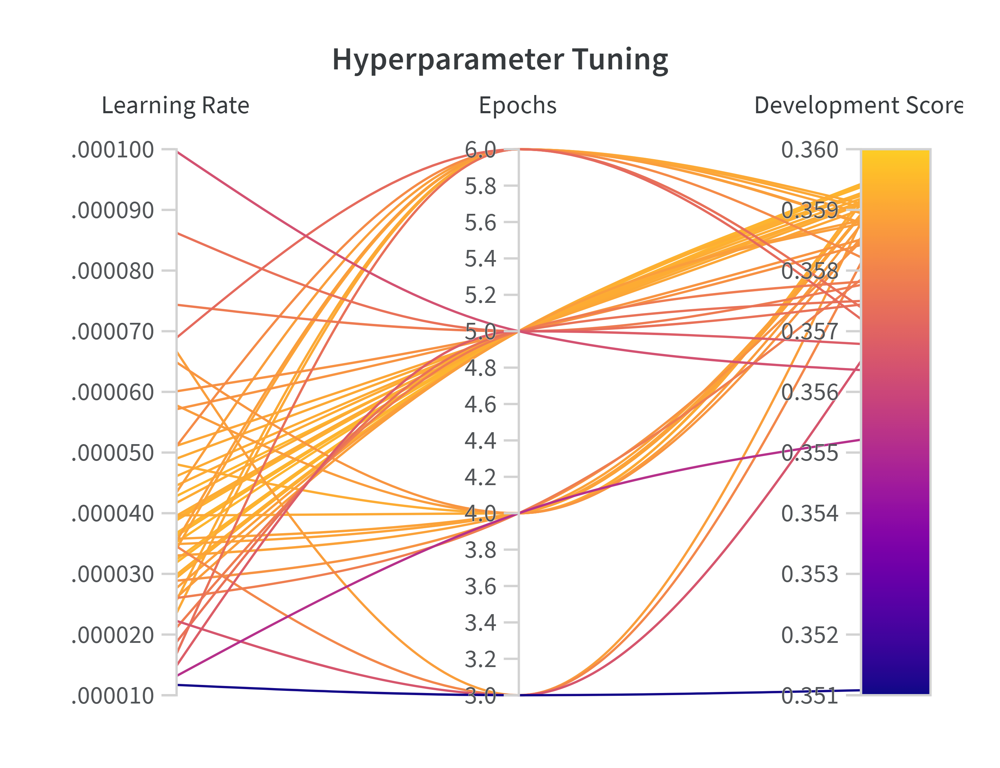

# Multilingual Retriever for Milton H. Erickson

This project presents the development of a multilingual model used for semantic search in a specefic domain. It powers a [search engine](https://github.com/Lone-Wolfgang/DocuTrance) dedicated for exploring the *Collected Works* of Milton H. Erickson M.D. 

[Erickson](https://en.wikipedia.org/wiki/Milton_H._Erickson) (1901-1980) made historically significant contributions to the fields of brief therapy and hypnosis. He maintains a dedicated international following of practitioners and researchers. He and his proteges were prolific writers, and lately, efforts have picked up to digitize their works. The purpose of the search engine is to connect his audience with the material that is most relevant to their interests. It is built on OpenSearch and enhanced with a hybrid retrieval approach that combines keyword and semantic scoring. He has significant audiences in Europe, Latin America, and East Asia. With the multilingual semantic retrieval system, users may query the Collected Works in their native language. However, the highly domain-specific language used in Ericksonian teaching materials—rich in therapeutic, metaphorical, and clinical terminology—is challenging for general-purpose language models. These terms are often unseen in other contexts and interpreted inconsistently across languages, making multilingual semantic search especially noisy. This is a classic case of domain specificity, and even flagship models continue to struggle with it.

This initial commit describes how I trained and evaluated the model. Further updates will go deeper into the code, aiming to be a useful resource for those aiming to build multilingual datasets or evaluate retrievers

## Outline

- **Multilingual Sentence Transformers**: Introduces the baseline models and explains how they were trained, leading to the finetuning methodology.
- **Training Data**: Describes how a dataset of cross-lingual sentence pairs was composed using a human-translated research and teaching manual for Ericksonian therapy.
- **Results**: Compares the baseline and Ericksonian models on cross-lingual alignment using a human-translated glossary and machine-generated queries.
- **Future Directions**: Identifies shortcomings and outlines a roadmap for upcoming developments.

## Multilingual Sentence Transformers

Current-generation AI models represent meaning using embeddings—numerical representations composed with tensors. Tensors are a data structure that is both computationally efficient and well-suited for modeling complex phenomena such as physical dynamics, temporal sequences, and  multidimensional space. Though embeddings are inscrutable in form, their role in natural language processing is conceptually straightforward: sentences with similar meanings should produce similar embeddings. Moreover, because embeddings inhabit the same geometric space, differences in meaning can be approximated using the same methods used to measure distance in physical space.

While multilingual models like mBERT and XLM-RoBERTa are capable of representing meaning across a variety of languages, they fall short when it comes to cross-lingual consistency. These models often map semantically identical sentences in different languages to divergent locations in embedding space. Misalignment introduces noise into semantic retrieval, where semantic similarity should ideally be language-agnostic. Multilingual sentence transformers address this issue by enforcing alignment across languages during training. From a monolingual teacher model, usually trained in English, the student model learns to produce embeddings that are not only semantically meaningful within each language but also consistent across translations. This is achieved through knowledge distillation on parallel sentence pairs, where the student is trained to map both the original and translated sentences to the same point in the embedding space. The result is a multilingual model that better supports cross-lingual information retrieval by reducing embedding drift between languages.

Off-the-shelf multilingual sentence transformers demonstrate surprising consistency when handling Ericksonian terminology. Nevertheless, the primary source material is both abundant and professionally translated, offering a high-quality foundation for further refinement. Where rich data exists, so does opportunity. This project builds upon the training objectives of multilingual sentence transformers by fine-tuning on parallel sentence pairs extracted from Ericksonian teaching materials, aligning the model more closely with the domain’s unique linguistic characteristics.

### Models

Two multilingual models from [SBERT](https://www.sbert.net/docs/sentence_transformer/pretrained_models.html) were adapted to Ericksonian terminology. In the context of this study, they are classified as *small* and *large*. The small model is less performant, but significantly more efficient in terms of speed and resource usage.

| Class   | Name                                  |   Performance |   Speed |   Dimensions | Size   |
|---------|---------------------------------------|---------------|---------|--------------|--------|
| small   | [paraphrase-multilingual-MiniLM-L12-v2](https://huggingface.co/sentence-transformers/paraphrase-multilingual-MiniLM-L12-v2) |         51.72 |    2500 |          384 | 420 MB |
| large   | [paraphrase-multilingual-mpnet-base-v2](https://huggingface.co/sentence-transformers/paraphrase-multilingual-mpnet-base-v2) |         53.75 |    7500 |          786 | 920 MB |

  - **Class:** Shorthand identifier for the target model.
  - **Name:** Link to the model card hosted on HuggingFace.
  - **Performance:** Average score across benchmark evaluations measuring sentence embedding quality and semantic retrieval.
  - **Speed:**  Encoding speed in sentences per second on a V100 GPU.
  - **Dimensions:** Length of the output embedding vector.
  - **Size:** Disk space required to store the model.

### Training and Evaluation

*[Figure 1](https://sbert.net/examples/sentence_transformer/training/multilingual/README.html): Training a multilingual sentence transformer using cross-lingual distillation. The student model is trained to yield embeddings that align with the teacher model. For multilingual distillation, a multilingual student model is trained to align its embeddings with an English teacher model.*

The models were trained and evaluated based on the script, [make_multilingual.py](https://github.com/UKPLab/sentence-transformers/blob/master/examples/sentence_transformer/training/multilingual/make_multilingual.py).

Both pretrained models already perform well on Ericksonian material. The goal of training was to further enhance domain-specific performance while preserving general multilingual competency. In this procedure, each pretrained model was initialized as both the student and the teacher. As a result, English embeddings remain fixed throughout training, while non-English embeddings are optimized to align more closely with their English counterparts.

Both pretrained models already performed well on Ericksonian material. The goal of training was to further enhance domain-specific performance while maintaining general multilingual competency. Each model was initialized as both the student and the teacher, ensuring that English embeddings remained fixed during training. Non-English embeddings were optimized to align more closely with their English counterparts.

Training loss was calculated using mean squared error (MSE) between student and teacher embeddings.

Evaluation involved two metrics:

 - **MSE**: Measures how closely the student embeddings matched the teacher embeddings.
 - **Translation Accuracy**: Assesses alignment quality by checking whether student and teacher embeddings correctly match across languages. Accuracy is computed as the percentage of correct pairings when matching in both directions (English → Non-English and Non-English → English).

 After training, the models are also evaluated on the consistency of cross-lingual retrieval using machine generated and translated queries.

## Training Data

Finetuning the models involved three datasets:

 - **[Ericksonian Core Competencies](https://huggingface.co/datasets/LoneWolfgang/ericksonian-core-competencies-multilingual):** The primary training material. A training manual that contextualizes the history and methodology of Ericksonian therapy. The [English](https://www.iamdrshort.com/PDF/Papers/Core%20Competencies%20Manual.pdf) source material has been carefully translated into four languages: [French](https://www.iamdrshort.com/New_Papers/Manuel%20des%20comp%C3%A9tences%20fondamentales%20en%20hypnose%20ericksonienne.pdf), [Italian](https://www.iamdrshort.com/New_Papers/CCET_Italiano.pdf), [Portuguese](http://iamdrshort.com/New_Papers/Princ%C3%ADpios%20e%20Compet%C3%AAncias%20Fundamentais%20da%20Terapia%20Ericksoniana%20(Primeira%20vers%C3%A3o).pdf), and [Spanish](http://iamdrshort.com/New_Papers/Princ%C3%ADpios%20e%20Compet%C3%AAncias%20Fundamentais%20da%20Terapia%20Ericksoniana%20(Primeira%20vers%C3%A3o).pdf).

 - **[Ericksonian Terminology](https://huggingface.co/datasets/LoneWolfgang/ericksonian-terminology-multilingual):** For evaluation. The terminology was extracted from a glossary designed to improve the consistency of language use betweeen Ericksonian practitioners. The [English](https://rerickson.gumroad.com/l/MHE_Glossary_English) glossary has been translated into [French](https://rerickson.gumroad.com/l/MHE_Glossary_French?layout=profile), [Italian](https://rerickson.gumroad.com/l/MHE_Glossary_Italian?layout=profile), [Portuguese](https://rerickson.gumroad.com/l/MHE_Glossary_Portuguese?layout=profile), [Russian](https://rerickson.gumroad.com/l/MHE_Glossary_Russian?layout=profile), and [Spanish](https://rerickson.gumroad.com/l/MHE_Glossary_Spanish?layout=profile). The *Core Competencies* contains an abridged version of the Ericksonian glossary. To prevent data leakage, those terms are witheld during training.
 
 - **[Ericksonian Queries](https://huggingface.co/datasets/LoneWolfgang/multilingual-queries-for-collected-works-of-milton-h-erickson):** For evaluation. The queries are machine generated and translated. The prompt and sampling strategy was designed to yield a dataset that is balanced and representative of the *Collected Works of Milton H. Erickson*. English queries were tranlated into Chinese, French, German, Italian, Japanese, Portuguese, Russian, and Spanish.

| Source            |   English Anchors |   Sentence Pairs | Untrained Languages   |
|-------------------|-------------------|------------------|-----------------------|
| Core Competencies |              1586 |             5687 | -                     |
| Glossary          |               329 |             1090 | ru                    |
| Queries           |              1366 |            10928 | de, ja, ru, zh        |

*Table 1: Describes the contents of the training datasets. The Core Competencies is translated into four languages, each of which is represented in the other datasets. The Glossary and Queries contain additional unseen languages.*

### Splits

The training data was divided into three distinct sets:

 - **Train**: This set contains most of the material from the *Core Competencies*. It is fully visible to the student model and is used to teach generalizable knowledge.
 - **Development**: Used for hyperparameter tuning. After initial training, candidate models are evaluated on this set. A Bayesian search algorithm iteratively adjusts the hyperparameters to optimize performance for the given model and dataset. While tuning, the student model is partially exposed to this set.
 - **Test**: A held-out, unbiased set used to verify that the selected hyperparameters result in a model that generalizes well, rather than one that has simply overfit to the development data.

 The datasets each have multiple translations for common English anchors. To avoid data leakage, the examples were grouped by their English anchor before splitting.

|                   | Train   |   Development | Test   |
|-------------------|---------|---------------|--------|
| Core Competencies | 5191    |           573 | -      |
| Glossary          | -       |           544 | 546    |
| Queries           | -       |          5464 | 5464   |

*Table 2: Describes the contents of the splits. 85% of the Core Competencies while the remainder was placed the train split while the remainder was placed in development. The Glossary and Queries were split 50/50 between the development and train splits.*

## Results

  
  

