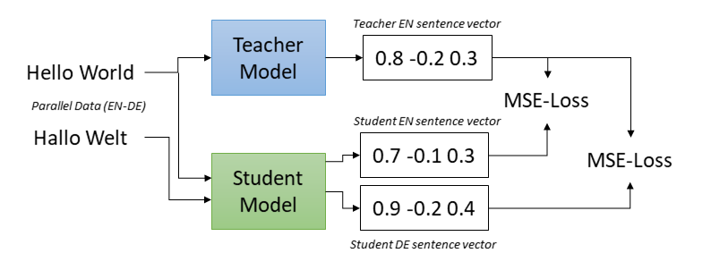

# Multilingual Retriever for Milton H. Erickson

This project presents the development of a multilingual model used for semantic search in a specefic domain. It powers a [search engine](https://github.com/Lone-Wolfgang/DocuTrance) dedicated for exploring the *Collected Works* of Milton H. Erickson M.D. 

[Erickson](https://en.wikipedia.org/wiki/Milton_H._Erickson) (1901-1980) made historically significant contributions to the fields of brief therapy and hypnosis. He maintains a dedicated international following of practitioners and researchers. He and his proteges were prolific writers, and lately, efforts have picked up to digitize their works. The purpose of the search engine is to connect his audience with the material that is most relevant to their interests. It is built on OpenSearch and enhanced with a hybrid retrieval approach that combines keyword and semantic scoring. He has significant audiences in Europe, Latin America, and East Asia. With the multilingual semantic retrieval system, users may query the Collected Works in their native language. However, the highly domain-specific language used in Ericksonian teaching materials—rich in therapeutic, metaphorical, and clinical terminology—is challenging for general-purpose language models. These terms are often unseen in other contexts and interpreted inconsistently across languages, making multilingual semantic search especially noisy. This is a classic case of domain specificity, and even flagship models continue to struggle with it.

This initial commit describes how I trained and evaluated the model. Further updates will go deeper into the code, aiming to be a useful resource for those aiming to build multilingual datasets or evaluate retrievers

## Outline

- **Multilingual Sentence Transformers**: Introduces the baseline models and explains how they were trained, leading to the finetuning methodology.
- **Training Data**: Describes how a dataset of cross-lingual sentence pairs was composed using a human-translated research and teaching manual for Ericksonian therapy.
- **Results**: Compares the baseline and Ericksonian models on cross-lingual alignment using a human-translated glossary and machine-generated queries.
- **Future Directions**: Identifies shortcomings and outlines a roadmap for upcoming developments.


## Multilingual Sentence Transformers

Current-generation AI models represent meaning using embeddings—numerical representations composed with tensors. Tensors are a data structure that is both computationally efficient and well-suited for modeling complex phenomena such as physical dynamics, temporal sequences, and  multidimensional space. Though embeddings are inscrutable in form, their role in natural language processing is conceptually straightforward: sentences with similar meanings should produce similar embeddings. Moreover, because embeddings inhabit the same geometric space, differences in meaning can be approximated using the same methods used to measure distance in physical space.

While multilingual models like mBERT and XLM-RoBERTa are capable of representing meaning across a variety of languages, they fall short when it comes to cross-lingual consistency. These models often map semantically identical sentences in different languages to divergent locations in embedding space. Misalignment introduces noise into semantic retrieval, where semantic similarity should ideally be language-agnostic. Multilingual sentence transformers address this issue by enforcing alignment across languages during training. From a monolingual teacher model, usually trained in English, the student model learns to produce embeddings that are not only semantically meaningful within each language but also consistent across translations. This is achieved through knowledge distillation on parallel sentence pairs, where the student is trained to map both the original and translated sentences to the same point in the embedding space. The result is a multilingual model that better supports cross-lingual information retrieval by reducing embedding drift between languages.

Off-the-shelf multilingual sentence transformers demonstrate surprising consistency when handling Ericksonian terminology. Nevertheless, the primary source material is both abundant and professionally translated, offering a high-quality foundation for further refinement. Where rich data exists, so does opportunity. This project builds upon the training objectives of multilingual sentence transformers by fine-tuning on parallel sentence pairs extracted from Ericksonian teaching materials, aligning the model more closely with the domain’s unique linguistic characteristics.

### Models

Two multilingual models from [SBERT](https://www.sbert.net/docs/sentence_transformer/pretrained_models.html) were adapted to Ericksonian terminology. In the context of this study, they are classified as *small* and *large*. The small model is less performant, but significantly more efficient in terms of speed and resource usage.

| Class   | Name                                  |   Performance |   Speed |   Dimensions | Size   |
|---------|---------------------------------------|---------------|---------|--------------|--------|
| small   | [paraphrase-multilingual-MiniLM-L12-v2](https://huggingface.co/sentence-transformers/paraphrase-multilingual-MiniLM-L12-v2) |         51.72 |    2500 |          384 | 420 MB |
| large   | [paraphrase-multilingual-mpnet-base-v2](https://huggingface.co/sentence-transformers/paraphrase-multilingual-mpnet-base-v2) |         53.75 |    7500 |          786 | 920 MB |

  - **Class:** Shorthand identifier for the target model.
  - **Name:** Link to the model card hosted on HuggingFace.
  - **Performance:** Average score across benchmark evaluations measuring sentence embedding quality and semantic retrieval.
  - **Speed:**  Encoding speed in sentences per second on a V100 GPU.
  - **Dimensions:** Length of the output embedding vector.
  - **Size:** Disk space required to store the model.

### Training and Evaluation


*[Figure 1](https://sbert.net/examples/sentence_transformer/training/multilingual/README.html): Training a multilingual sentence transformer using cross-lingual distillation. The student model is trained to yield embeddings that align with the teacher model. For multilingual distillation, a multilingual student model is trained to align its embeddings with an English teacher model.*

The models were trained and evaluated based on the script, [make_multilingual.py](https://github.com/UKPLab/sentence-transformers/blob/master/examples/sentence_transformer/training/multilingual/make_multilingual.py).

Both pretrained models already perform well on Ericksonian material. The goal of training was to further enhance domain-specific performance while preserving general multilingual competency. In this procedure, each pretrained model was initialized as both the student and the teacher. As a result, English embeddings remain fixed throughout training, while non-English embeddings are optimized to align more closely with their English counterparts.

Both pretrained models already performed well on Ericksonian material. The goal of training was to further enhance domain-specific performance while maintaining general multilingual competency. Each model was initialized as both the student and the teacher, ensuring that English embeddings remained fixed during training. Non-English embeddings were optimized to align more closely with their English counterparts.

Training loss was calculated using mean squared error (MSE) between student and teacher embeddings.

## Training Data

Finetuning the models involved three datasets. This repository includes some interactive [notebooks](https://github.com/Lone-Wolfgang/multilingual-retriever-for-milton-h-erickson/tree/main/prepare_data) explain the prepration methodology:

 - **[Ericksonian Core Competencies](https://huggingface.co/datasets/LoneWolfgang/ericksonian-core-competencies-multilingual):** The primary training material. A training manual that contextualizes the history and methodology of Ericksonian therapy. The [English](https://www.iamdrshort.com/PDF/Papers/Core%20Competencies%20Manual.pdf) source material has been carefully translated into four languages: [French](https://www.iamdrshort.com/New_Papers/Manuel%20des%20comp%C3%A9tences%20fondamentales%20en%20hypnose%20ericksonienne.pdf), [Italian](https://www.iamdrshort.com/New_Papers/CCET_Italiano.pdf), [Portuguese](http://iamdrshort.com/New_Papers/Princ%C3%ADpios%20e%20Compet%C3%AAncias%20Fundamentais%20da%20Terapia%20Ericksoniana%20(Primeira%20vers%C3%A3o).pdf), and [Spanish](http://iamdrshort.com/New_Papers/Princ%C3%ADpios%20e%20Compet%C3%AAncias%20Fundamentais%20da%20Terapia%20Ericksoniana%20(Primeira%20vers%C3%A3o).pdf).

 - **[Ericksonian Terminology](https://huggingface.co/datasets/LoneWolfgang/ericksonian-terminology-multilingual):** For evaluation. The terminology was extracted from a glossary designed to improve the consistency of language use betweeen Ericksonian practitioners. The [English](https://rerickson.gumroad.com/l/MHE_Glossary_English) glossary has been translated into [French](https://rerickson.gumroad.com/l/MHE_Glossary_French?layout=profile), [Italian](https://rerickson.gumroad.com/l/MHE_Glossary_Italian?layout=profile), [Portuguese](https://rerickson.gumroad.com/l/MHE_Glossary_Portuguese?layout=profile), [Russian](https://rerickson.gumroad.com/l/MHE_Glossary_Russian?layout=profile), and [Spanish](https://rerickson.gumroad.com/l/MHE_Glossary_Spanish?layout=profile). The *Core Competencies* contains an abridged version of the Ericksonian glossary. To prevent data leakage, those terms are witheld during training.
 
 - **[Ericksonian Queries](https://huggingface.co/datasets/LoneWolfgang/multilingual-queries-for-collected-works-of-milton-h-erickson):** For evaluation. The queries are machine generated and translated. The prompt and sampling strategy was designed to yield a dataset that is balanced and representative of the *Collected Works of Milton H. Erickson*. English queries were tranlated into Chinese, French, German, Italian, Japanese, Portuguese, Russian, and Spanish.

| Source            |   English Anchors |   Sentence Pairs |   Unseen Languages    |
|-------------------|-------------------|------------------|-----------------------|
| Core Competencies |              1586 |             5687 | -                     |
| Glossary          |               329 |             1090 | ru                    |
| Queries           |              1366 |            10928 | de, ja, ru, zh        |

*Table 1: Describes the contents of the training datasets. The Core Competencies is translated into four languages, each of which is represented in the other datasets. The Glossary and Queries contain additional unseen languages.*

### Splits

The training data was divided into three distinct sets:

 - **Train**: This set contains most of the material from the *Core Competencies*. It is fully visible to the student model and is used to teach generalizable knowledge.
 - **Development**: Used for hyperparameter tuning. After initial training, candidate models are evaluated on this set. A Bayesian search algorithm iteratively adjusts the hyperparameters to optimize performance for the given model and dataset. While tuning, the student model is partially exposed to this set.
 - **Test**: A held-out, unbiased set used to verify that the selected hyperparameters result in a model that generalizes well, rather than one that has simply overfit to the development data.

 The datasets each have multiple translations for common English anchors. To avoid data leakage, the examples were grouped by their English anchor before splitting.

|                   | Train   |   Development | Test   |
|-------------------|---------|---------------|--------|
| Core Competencies | 5191    |           573 | -      |
| Glossary          | -       |           544 | 546    |
| Queries           | -       |          5464 | 5464   |

*Table 2: Describes the contents of the splits. 85% of the Core Competencies while the remainder was placed the train split while the remainder was placed in development. The Glossary and Queries were split 50/50 between the development and train splits.*

## Results

### Training Evaluation

Evaluation during training involved two metrics:

 - **MSE**: Measures how closely the student embeddings matched the teacher embeddings.
 - **Translation Accuracy**: Assesses alignment quality by checking whether student and teacher embeddings correctly match across languages. Accuracy is computed as the percentage of correct pairings when matching in both directions (English → Non-English and Non-English → English).

During training, scores were computed for both metrics on the development set and combined using a [sequential evaluator](https://sbert.net/docs/package_reference/sentence_transformer/evaluation.html)

#### Hyperparameter Tuning and the Top Five Trials

<p float="left">
  
  
</p>

*Figure 2: A simple hyperparameter sweep was run on two high impact hyperparameters: the learning rate and number of training epochs. The top run was selected by the sequential score on the test set*

During training, performance was also monitored on individual language subsets. Languages were grouped based on whether they were included in the Core Competencies training material:

 - **Seen Languages:** French, Italian, Spanish, Portuguese
 - **Unseen Languages:** Chinese, German, Japanese, Russian

Each language represents one of Erickson’s largest audiences, so maintaining strong performance across all groups is essential. Improvement was expected in the *seen* languages because they are included in the training data. Ideally, the model would also benefit from cross-lingual transfer to the *unseen* languages. However, even stable performance in those languages would be considered acceptable. A decline in performance for *unseen* languages, on the other hand, would suggest the need to reevaluate the training strategy.

In the series of figures that follow, *seen* languages are shown in blue, and *unseen* in red.

#### Performance on the Core Competencies by Train Epoch


*Figure 3: When measured by MSE, model performance improved across all languages. Translation accuracy began at a high level (~99%) and either remained stable or showed a slight decline over the course of training. Unlike the other two datasets, Core Competencies consists of a continuous body of text. This increases the likelihood that some evaluation examples were semantically linked, introducing the possibility of false negatives. Additionally, Core Competencies uses more common terminology, so a decline in accuracy may reflect a loss of general competency due to domain adaptation. While the slight instability in translation accuracy was unexpected, the overall improvement in MSE and the consistently high accuracy are considered positive outcomes.*

#### Performance on Ericksonian Terminology by Train Epoch


*Figure 4: In this case, performance improves across both metrics for all languages. Initial scores are lower, reflecting the tendency of general-purpose language models to struggle with domain-specific terminology. The unseen language, Russian, starts at a particularly low point—likely due to the use of Cyrillic script, in contrast to the Latin script used by the other languages. Although Russian ends with the lowest absolute performance, it shows the largest overall gain, with translation accuracy increasing from 74% to 80%. This is considered a highly positive outcome.*

#### Performance on Ericksonian Queries by Train Epoch


*Figure 5: Once again, performance improves across all metrics for all languages, with the seen languages finishing at higher levels than the unseen ones. Initial performance falls between that of the Core Competencies and Queries datasets. Among the languages, those using Latin script start highest, followed by Russian, then Chinese and Japanese. Notably, languages with lower starting points tend to show the greatest improvements, regardless of whether they were seen or unseen during training. Overall, this is considered a highly positive outcome.*

### Evaluation of Embedding Aligment

Cosine similarity is an alternative to MSE for measuring embedding similarity. It ranges from -1 to 1, where 1 indicates identical terms, -1 indicates complete opposition, and 0 suggests no meaningful relationship. Cosine similarity was computed before and after training on the test split of the Ericksonian terminology between each term and its tranlation.

#### Cosine Similarity of Ericksonian Terminology, Before and After Training


*Figure 6: Results before and after training the large model. MHE (Milton H. Erickson) refers to the trained model. The control model already performs well, with over 65% of terms scoring above 0.8 in similarity. Training further improves alignment, with scores above 0.9 climbing by about 40%.*

#### Improvement in Embedding Alignment by Language

| Language   |   Before |   After |   Difference |
|------------|----------|---------|--------------|
| Spanish    |    0.842 |   0.882 |        0.04  |
| French     |    0.827 |   0.884 |        0.057 |
| Italian    |    0.828 |   0.89  |        0.061 |
| Portuguese |    0.829 |   0.888 |        0.06  |
| Russian    |    0.765 |   0.82  |        0.055 |

*Table 4: Change in cosine similarity after training. Improvements are consistent across languages. Russian shows changes comparable to the seen languages, which is encouraging; however, its lower starting point likely contributed to the larger observed gains.*

#### Most Improved Terms

| Term                     |   Before |   After |   Difference |
|--------------------------|----------|---------|--------------|
| light trance             |    0.675 |   0.938 |        0.264 |
| trance identification    |    0.653 |   0.892 |        0.239 |
| waking trance            |    0.717 |   0.938 |        0.222 |
| formal trance            |    0.734 |   0.955 |        0.221 |
| group trance             |    0.746 |   0.955 |        0.208 |
| common everyday trance   |    0.721 |   0.928 |        0.206 |
| trance logic             |    0.776 |   0.953 |        0.177 |
| deep trance              |    0.805 |   0.977 |        0.172 |
| inflection               |    0.549 |   0.717 |        0.168 |
| authoritative hypnosis   |    0.772 |   0.934 |        0.162 |
| hypnotist                |    0.812 |   0.972 |        0.16  |
| competence               |    0.746 |   0.894 |        0.148 |
| self hypnosis            |    0.853 |   0.977 |        0.124 |
| flat affect              |    0.402 |   0.519 |        0.117 |
| bonding                  |    0.572 |   0.687 |        0.115 |
| auto-hypnosis            |    0.879 |   0.988 |        0.108 |
| post-hypnotic suggestion |    0.854 |   0.958 |        0.104 |
| ericksonian hypnosis     |    0.887 |   0.99  |        0.103 |
| linking                  |    0.524 |   0.624 |        0.1   |
| waxy flexibility         |    0.623 |   0.721 |        0.098 |

*Table 5: Displays 20 terms from the Ericksonian Terminology test split with the largest average increase in cosine similairity. Most of the terms are some variation to trance or hypnosis, which are central topics of Ericksonian works.*

### Evaluation of Retrieval Performance

The final evaluation measures how training impacts the model’s performance on its core task: document retrieval. Although this is the most important assessment, it is also extremely noisy due to the  complexity of the search engine architecture. 

The retrieval system uses a hybrid scoring algorithm that combines keyword and semantic similarity. The keyword component is based on the Best Match 25 (BM25) algorithm, a standard choice in modern search engines. Additional weight is given to certain features, such as exact phrase matches and title matches. To improve recall and consistency, documents are also indexed in lemmatized form.

The semantic retrieval component ranks documents based on the similarity between embeddings of the query and various document fields. This approach is especially powerful because it can retrieve relevant results even when the query words are not explicitly present in the document.

However, semantic models are constrained by their context window. In this case, the limit is 128 tokens, or approximately 50–60 words. This makes it impractical to embed full-length chapters or documents. To compensate, each document is indexed not only by its full content but also by an AI-generated summary and a list of AI-extracted keywords, which help preserve essential information within the limited context window.

This evaluation investigates two questions:

 1. **Cross-lingual consistency:** When using semantic search alone, how consistent are retrieval results for translated (non-English) queries compared to their original English versions? Since the goal of training was to align non-English and English embeddings, translated queries should ideally retrieve the same documents as their English counterparts.

 2. **Retrieval strategy consistency:** For English queries, how consistent are the results across BM25-only, semantic-only, and hybrid retrieval strategies? In an ideal scenario, these methods would produce highly similar results. This would suggest that non-English users, whose queries rely more heavily on semantic search, can retrieve relevant documents just as effectively as English users.

 The top five documents for each query in the Ericksonian Queries test split was retrieved with variation in query language and retrieval strategy. Reuslts were compared through three metrics:
  - **Top-1 Accuracy:** The frequency with which the top-ranked document is an exact match. This metric is important because the top result strongly influences user experience, though it provides only a shallow measure of performance.
  - **Jaccard Similairty:** The proportion of overlap between the sets of top five documents. This metric offers a broader view than Top-1 Accuracy by considering multiple results, but it is insensitive to the order in which documents are ranked.
  - **Rank Based Overlap:**  A ranking-aware metric that captures both the degree of overlap and the relative positions of the retrieved documents. It provides a more rounded assessment of retrieval consistency.

#### Cross-lingual Consistency of Semantic Retrieval

<table>
  <thead>
    <tr>
      <th>Class</th>
      <th>Model</th>
      <th>Lang Group</th>
      <th>Top-1 Match</th>
      <th>Jaccard Similarity</th>
      <th>RBO</th>
    </tr>
  </thead>
  <tbody>
    <tr>
      <td rowspan="4">Small</td>
      <td rowspan="2">Control</td>
      <td>seen</td>
      <td>35.8%</td>
      <td>36.2%</td>
      <td>0.417</td>
    </tr>
    <tr>
      <td>unseen</td>
      <td>27.9%</td>
      <td>31.4%</td>
      <td>0.355</td>
    </tr>
    <tr>
      <td rowspan="2">MHE</td>
      <td>seen</td>
      <td>55.2%</td>
      <td>53.2%</td>
      <td>0.605</td>
    </tr>
    <tr>
      <td>unseen</td>
      <td>35.7%</td>
      <td>38.0%</td>
      <td>0.431</td>
    </tr>
    <tr>
      <td rowspan="4">Large</td>
      <td rowspan="2">Control</td>
      <td>seen</td>
      <td>53.4%</td>
      <td>50.1%</td>
      <td>0.580</td>
    </tr>
    <tr>
      <td>unseen</td>
      <td>44.1%</td>
      <td>41.5%</td>
      <td>0.490</td>
    </tr>
    <tr>
      <td rowspan="2">MHE</td>
      <td>seen</td>
      <td><strong>64.8%</strong></td>
      <td><strong>61.7%</strong></td>
      <td><strong>0.688</strong></td>
    </tr>
    <tr>
      <td>unseen</td>
      <td><strong>49.1%</strong></td>
      <td><strong>47.1%</strong></td>
      <td><strong>0.545</strong></td>
    </tr>
  </tbody>
</table>

*Table 5: The experimental (MHE) model signficantly outperforms the control in both size classes. The large MHE model takes the top scores. The small MHE model outperforms the large control on the seen languages, it underperforms on the unseen languages. Interestingly, not only to the seen languages start higher, they also make much larger gains, which is inconsistent with earlier observations.*


#### Consistency of Keyword, Semantic, and Hybrid Retrieval for English Queries

<table>
  <thead>
    <tr>
      <th>Class</th>
      <th>Model</th>
      <th>Retrieval Methods</th>
      <th>Top-1 Match</th>
      <th>Jaccard Similarity</th>
      <th>RBO</th>
    </tr>
  </thead>
  <tbody>
    <tr>
      <td rowspan="6">Small</td>
      <td rowspan="3">Control</td>
      <td>Hybrid vs. Semantic</td>
      <td>13.5%</td>
      <td>10.2%</td>
      <td>0.152</td>
    </tr>
    <tr>
      <td>Hybrid vs. Keyword</td>
      <td>70.0%</td>
      <td>68.2%</td>
      <td>0.753</td>
    </tr>
    <tr>
      <td>Semantic vs. Keyword</td>
      <td>12.6%</td>
      <td>9.8%</td>
      <td>0.142</td>
    </tr>
    <tr>
      <td rowspan="3">MHE</td>
      <td>Hybrid vs. Semantic</td>
      <td>13.8%</td>
      <td>9.6%</td>
      <td>0.148</td>
    </tr>
    <tr>
      <td>Hybrid vs. Keyword</td>
      <td>70.0%</td>
      <td>68.2%</td>
      <td>0.753</td>
    </tr>
    <tr>
      <td>Semantic vs. Keyword</td>
      <td>13.2%</td>
      <td>9.3%</td>
      <td>0.140</td>
    </tr>
    <tr>
      <td rowspan="6">Large</td>
      <td rowspan="3">Control</td>
      <td>Hybrid vs. Semantic</td>
      <td>13.2%</td>
      <td>9.8%</td>
      <td>0.148</td>
    </tr>
    <tr>
      <td>Hybrid vs. Keyword</td>
      <td>70.0%</td>
      <td>68.2%</td>
      <td>0.753</td>
    </tr>
    <tr>
      <td>Semantic vs. Keyword</td>
      <td>13.6%</td>
      <td>9.7%</td>
      <td>0.144</td>
    </tr>
    <tr>
      <td rowspan="3">MHE</td>
      <td>Hybrid vs. Semantic</td>
      <td>12.4%</td>
      <td>9.8%</td>
      <td>0.142</td>
    </tr>
    <tr>
      <td>Hybrid vs. Keyword</td>
      <td>70.0%</td>
      <td>68.2%</td>
      <td>0.753</td>
    </tr>
    <tr>
      <td>Semantic vs. Keyword</td>
      <td>12.7%</td>
      <td>9.6%</td>
      <td>0.137</td>
    </tr>
  </tbody>
</table>

*Table 6: Semantic retrieval proved highly inconsistent when compared to hybrid and keyword-based methods. In contrast, keyword and hybrid approaches showed strong mutual consistency. Although this result is disappointing, the underlying causes remain poorly understood and may reflect broader trends in retrieval systems. While training may have helped align the neural retriever, it is unclear whether this leads to meaningful improvements for non-English users.*

## Future Directions

This was an exciting project to work on. It was an especially positive outcome to see improvement in the unseen languages, and its possible more training data could bring even better results. However, semantic retrieval remained inconsistent with hybrid methods. This suggests that there is a problem that goes deeper than the model. Future work will explore ways to improve integration between semantic and keyword-based scoring, and investigate whether cross-lingual consistency can be better leveraged to support multilingual users that are browsing the *Collected Works of Milton H. Erickson*.

### More Training Data

The *Core Competencies* has also been translated into Bahasa Indonesian. However, unlike the other manuals, it is not strictly aligned at the sentence level. After a closer review, I plan to incorporate portions of it in a future update.

Several other Ericksonian works have been privately translated and published. If I am able to secure cooperation from the rights holders, I hope to obtain additional high-quality training material in languages such as German, Chinese, Japanese, and Russian.

### A Better Teacher Model

The student model’s performance is ultimately limited by the quality of the teacher. Ideally, domain adaptation should start with the teacher model. One option is to adapt it using the masked language modeling objective on the Collected Works. However, this approach is slow and resource-intensive. Introducing a core-level hyperparameter like this can quickly escalate the training budget. It’s an exciting direction, but one that requires careful planning, clear goals, and significant investment.

### A More Robust Index

Semantic search depends heavily on the quality of the indexed summaries and keywords, which were generated using AI. While they’ve passed basic checks, their accuracy and relevance haven’t been fully validated. As the project progresses, greater focus will be placed on refining these fields. Improving their quality is expected to enhance the consistency and reliability of retrieval results.

### Human Produced Queries

Retrieval systems are typically evaluated using human-generated queries, but such data wasn’t available for this project. With the upcoming launch of the search engine, real user queries will soon become accessible. These will offer valuable insight into user intent and allow for targeted tuning of the system to better meet their needs.

## References

```
@inproceedings{reimers-2020-multilingual-sentence-bert,
  title = "Making Monolingual Sentence Embeddings Multilingual using Knowledge Distillation",
  author = "Reimers, Nils and Gurevych, Iryna",
  booktitle = "Proceedings of the 2020 Conference on Empirical Methods in Natural Language Processing",
  month = "11",
  year = "2020",
  publisher = "Association for Computational Linguistics",
  url = "https://arxiv.org/abs/2004.09813",
}

@manual{short2017ericksonian,
  title = "Principles and Core Competencies of Ericksonian Therapy: The 2017 Research and Teaching Manual for Ericksonian Therapy",
  editor = "Dan Short",
  author = "Dan Short and Scott D. Miller",
  organization = "Milton H. Erickson Foundation",
  year = "2017",
  publisher = "Milton H. Erickson Institute of Phoenix",
  address = "Phoenix, AZ",
  url = "https://iamdrshort.com/book.htm"
}

```


